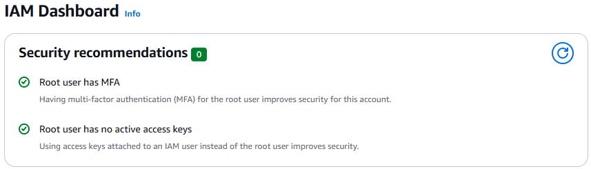
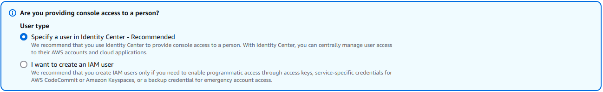
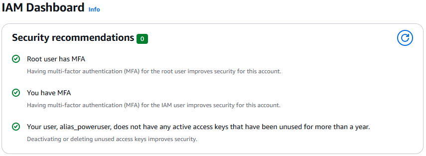

# Setup Identity & Access Management (IAM) User
As part of the best practices to secure the AWS account root user, the below guide show how to create an **IAM PowerUser** that has a full access to the AWS resources and services except **billing**, and can perform all tasks, but **critical root-level actions**.

## Step-by-Step Guide
### 1. Log in to the AWS Management Console and Navigate to IAM Dashboard
- Use the **root user** to log in to your AWS account.
- In the **search box** at the top-left corner of the page, search **IAM**
- In the **IAM Dashboard**, confirm the security recommendations for the root user are all met, and no further actions required
**Security recommendations list - No pending actions

- Navigate to **Users** under **Access management** in the left-hand navigation panel.

### 2. Create the IAM Power User
- Click **Create user** to access the creation workflow
- **Specify user details step**
    - **User details**
        - Enter **User name**
        - Check **Provide user access to the AWS Management Console - *optional*** option to provide console access to the **power user**
        - If **Are you providing console access to a person?** question prompted, then select **I want to create an IAM user.

        

        - **Console password** for improved security, keep the default selection: **Autogenerated password**, the password will be viewable after creating the user
        - Keep the check box **Users must create a new password at next sign-in - *Recommended*** selected.
            *At the first sign-in the user will have to create a new password that follow the password requirements detailed in the **account-password-policy***
        - Click **Next**
    - **Set permissions**
        - We can create **PowerUsers** group, to include all power users and add our first power user to it.
            - **Permissions options**: Keep the defelt selection **Add user to group**
            - **User groups** Click **Create group** to create the PowerUsers group
                 - Enter **User group name** as PowerUsers.
                 - **Permission policies**
                    - Select **AdministratorAceess**: Provides full access to AWS services and resources.
                    *The AdministratorAceess policy include 2 important actions: GetAccountPassordPolicy and UpdateAccountPasswordPolicy that we will use shortly*
                - Click **Create user group**
            
            - Select the **PowerUsers Group
            - Click **Next**
    - **Review and create**
        - **Tags** - *Optional*: tags are key-value pairs you can add to AWS resources to help identify, organize, or search for resources.
            key: user-type, value: IAM power user
        - Review all the information and click **Create user** 🎉🎉🎉
    - **Retrieve password**
        - If autogenerated password selected in the first step, the the temporary autogenerated password will be viewed and used for the first time sign-in and then you
        will be requested to reset it with new password.
        - You can use **Email sign-in instructions** feature to email yourself the next steps to sign in with the new user.
        - Also you can download the credentials info in a .csv format.
        ⚠️*Warning - Make sure to store the credential safely*
        - Click **Return to users list** to view the users list and complete the IAM user security setup

### 3. Assign MFA Device
Secure the new user's console access by assigning MFA device in the **Multi-Factor Authentication** section

### 4. Sign-in with IAM Power User
- To sign in with the IAM user, you will need the **Account ID** or the **Account alias**
Sign-out the root user and re-sign in with the newly created IAM user
- In the sign in page select **Sign in with IAM user
    - Enter **Account ID** or the **Account alias**
    - Enter the IAM user **username**
    - Enter the **autogenerated password**
    - Enter **MFA** code
    - You will be prompted to enter new password for the account
    - YOU ARE IN WITH YOUR SUPER DOOPER IAM USER NOW!!!

### 5. Create Access Keys
- IAM users can create up to 2 **Access Keys** that can be used to access resources, configuring AWS CLI and AWS SDK
- Go to IAM **Dashboard**.
- Confirm that all **Security recommendations** are met and no actions pending
**Security recommendations list - No pending actions

- Navigate to **Users** list, and select the IAM user with admin rights
- Select **Security credentials** tab.
- In **Access keys** section click **Create access key**
- Select a **Use case** and click **Next**
- Set description **tag** - *optional*
- **Create access key**
- **Retrive access key**

## Next steps
Now you can configure AWS CLI with the IAM user credentials by following instructions in [AWS CLI Setup](./02-aws-cli-setup.md#configure-aws-cli-with-iam-user)

